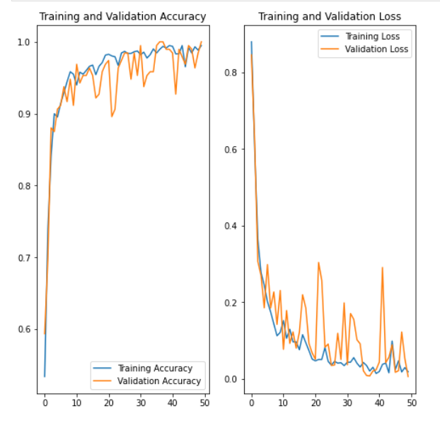

# AgriCare: Potato-Disease-Classification

Potato is one of the most cultivated and in-demand crops after rice and wheat. Potato farming dominates as an occupation in the agriculture domain in more than 125 countries. However, even these crops are, subjected to infections and diseases, mostly categorized into two grades: 
<h4>(i) Early blight    (ii) Late blight.</h4>Moreover, these diseases lead to damage the crop and decreases its production. In this paper, we propose a deep learning-based approach to detect the early and late blight diseases in potato by analyzing the visual interpretation of the leaf of several potato crops. 
<h2>Early Blight</b><h2>
 
<h2>Late Blight</h2> 
  
<h2>This CNN model developed in this project is as follows:</h2> 
 
<h2>Training of the model</h2> 
 
<h2>The above model provides an accuracy of 98 % on test dataset!</h2>

